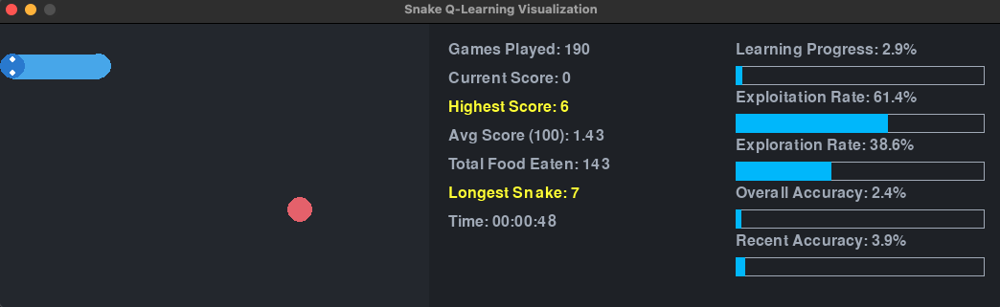

# Snake Game Q-Learning Project

## Table of Contents
1. [Introduction](#introduction)
2. [Project Overview](#project-overview)
3. [Screenshot](#screenshot)
4. [Requirements](#requirements)
5. [Installation](#installation)
6. [Project Structure](#project-structure)
7. [How It Works](#how-it-works)
8. [Usage](#usage)
9. [Customization](#customization)
10. [Troubleshooting](#troubleshooting)
11. [Contributing](#contributing)
12. [License](#license)

## Introduction

This project implements a Q-learning algorithm to train an AI agent to play the classic Snake game. The agent learns to navigate the game board, collect food, and avoid collisions through reinforcement learning. The project includes a visual representation of the game and the learning process using Pygame.

## Project Overview

The Snake Q-Learning project consists of several key components:

1. **Snake Game**: A Python implementation of the classic Snake game.
2. **Q-Learning Agent**: An AI agent that learns to play the game using the Q-learning algorithm.
3. **Visualization**: A Pygame-based visualization of the game and the learning process.

The project demonstrates how reinforcement learning can be applied to teach an AI to play a simple game, providing insights into the learning process through real-time statistics and visualizations.

## Screenshot



*This screenshot shows the Snake game in action, with the AI agent controlling the snake. The right side displays real-time learning statistics and progress bars.*

## Requirements

To run this project, you'll need:

- Python 3.7+
- NumPy
- Pygame

## Installation

1. Clone the repository:
   ```
   git clone https://github.com/19bk/snake-qlearning.git
   cd snake-qlearning
   ```

2. (Optional) Create and activate a virtual environment:
   ```
   python -m venv venv
   source venv/bin/activate  # On Windows, use `venv\Scripts\activate`
   ```

3. Install the required packages:
   ```
   pip install numpy pygame
   ```

## Project Structure

The project consists of a single Python file `main.py` with the following classes and functions:

- `SnakeGame`: Implements the game logic.
- `QLearningAgent`: Implements the Q-learning algorithm.
- `SnakeVisualization`: Handles the game visualization using Pygame.
- `train_and_visualize()`: Main function to run the training and visualization process.

## How It Works

1. **Game Mechanics**: The `SnakeGame` class manages the game state, including the snake's position, food placement, and collision detection.

2. **Q-Learning**: The `QLearningAgent` class implements the Q-learning algorithm. It maintains a Q-table to store state-action values and uses an epsilon-greedy strategy for action selection.

3. **State Representation**: The game state is represented as a binary array, encoding information about potential collisions, current direction, and food location relative to the snake's head.

4. **Learning Process**: 
   - The agent observes the current state and chooses an action (move direction).
   - The game updates based on this action, providing a new state and reward.
   - The agent updates its Q-values based on the reward and the estimated future reward.
   - This process repeats, with the agent gradually improving its strategy.

5. **Visualization**: The `SnakeVisualization` class uses Pygame to render the game board, snake, and food. It also displays real-time statistics about the learning process.

## Usage

To run the project, execute the `main.py` file:

```
python main.py
```

This will start the training process and open a Pygame window showing the game and learning statistics. The training will continue for the specified number of episodes or until you close the window.

## Customization

You can customize various aspects of the project by modifying parameters in the `main.py` file:

- In `SnakeGame.__init__()`: Adjust `width` and `height` to change the game board size.
- In `QLearningAgent.__init__()`: Modify learning parameters like `learning_rate`, `gamma`, `epsilon`, etc.
- In `train_and_visualize()`: Change `episodes`, `max_steps`, and `visualize_every` to adjust the training process.

## Troubleshooting

- If you encounter issues with Pygame, ensure you have the latest version installed and that your Python environment is correctly set up.
- If the learning process seems slow or ineffective, try adjusting the learning parameters or the state representation in the `SnakeGame._get_state()` method.


## Read the full article

https://www.linkedin.com/posts/bernard-kibathi_activity-7220298918755012608-2l1_?utm_source=share&utm_medium=member_desktop

## Contributing

Contributions to this project are welcome! Please fork the repository and submit a pull request with your changes.

## License

This project is open source and available under the [MIT License](LICENSE).

---

For any questions or issues, please open an issue on the GitHub repository.
